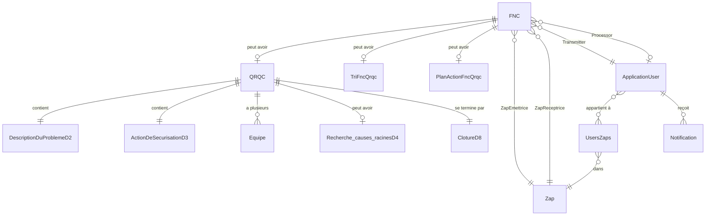

# 🏭 PFE Etudiant Asteelflash - Système de Gestion de la Qualité


## 📋 Description du Projet

**PFE Etudiant Asteelflash** est une application web complète de gestion de la qualité industrielle développée pour Asteelflash. Cette solution digitale modernise et optimise les processus de gestion des non-conformités et d'amélioration continue en milieu industriel.

Le système permet de gérer l'ensemble du cycle de vie des problèmes qualité, depuis leur détection jusqu'à leur résolution complète, en suivant les méthodologies **QRQC** (Quick Response Quality Control) et **8D** (8 Disciplines).

### 🎯 Objectifs Principaux
- **Digitalisation** des processus qualité actuellement papier
- **Traçabilité complète** des non-conformités et actions correctives
- **Collaboration en temps réel** entre les équipes
- **Réduction du temps de résolution** des problèmes qualité
- **Amélioration continue** basée sur les données collectées

## ✨ Fonctionnalités Principales

### 📝 Gestion des FNC (Fiches de Non-Conformité)
- **Création et suivi** des fiches de non-conformité
- **Workflow d'approbation** multi-niveaux (Conducteur → Chef d'équipe → Responsable → Ingénieur)
- **Classification** par type de défaut, impact, et urgence
- **Attachement de photos** pour documentation visuelle (jusqu'à 5 images)
- **Système de référencement** automatique
- **Filtrage avancé** et recherche multicritères
- **Statuts dynamiques** : Ouvert, En cours, Clôturé, Refusé

### 🔄 Processus QRQC (Quick Response Quality Control)
Implementation complète de la méthodologie QRQC en 8 étapes (8D) :

#### **D1 - Constitution de l'équipe**
- Formation d'équipes pluridisciplinaires
- Attribution des rôles et responsabilités

#### **D2 - Description du problème**
- Documentation détaillée avec méthode QQOQCP
- Analyse de l'impact client et production
- Évaluation des risques associés

#### **D3 - Actions de sécurisation immédiates**
- **Tri et isolation** des produits suspects
- **Réparation** des défauts identifiés
- **Confinement** pour éviter la propagation
- Suivi quantitatif détaillé (pièces triées, réparées, rebutées)

#### **D4 - Recherche des causes racines**
- Analyse des causes d'occurrence
- Analyse des causes de non-détection
- Utilisation des outils : 5 Pourquoi, Ishikawa, Pareto

#### **D5 - Plans d'actions correctives**
- Définition d'actions correctives permanentes
- Attribution des responsables et délais
- Suivi de l'avancement

#### **D6 - Suivi et validation**
- Vérification de l'efficacité des actions
- Mesure des indicateurs de performance

#### **D7 - Act (Standardisation)**
- Mise à jour des procédures
- Déploiement des bonnes pratiques

#### **D8 - Clôture et capitalisation**
- Validation finale par management
- Documentation des leçons apprises
- Archivage pour référence future

### 📊 Gestion des Réclamations
- Enregistrement des réclamations clients/internes
- Lien automatique avec les FNC associées
- Suivi du traitement et des réponses

### 📋 Plans d'Action
- **Création de plans d'action** structurés
- **Lignes d'action** détaillées avec responsables et échéances
- **Suivi d'avancement** en pourcentage
- **Alertes automatiques** sur les échéances

### 📈 Tri et Gestion des Quantités
- **Module de tri** pour isolation et réparation
- **Suivi quantitatif** par jour et par équipe
- **Calcul automatique** des taux de défauts
- **Tableaux de bord** de performance

### 🔔 Système de Notifications Temps Réel avec SignalR

#### Architecture SignalR
- **Hub centralisé** (`NotificationHub`) pour la communication bidirectionnelle
- **WebSocket** comme transport principal, avec fallback automatique (Server-Sent Events, Long Polling)
- **Connexion persistante** avec reconnexion automatique en cas de perte réseau
- **Groupes d'utilisateurs** pour notifications ciblées par ZAP ou rôle
- **Broadcasting** instantané des événements système

#### Implémentation Technique
```csharp
// Hub SignalR pour notifications temps réel
public class NotificationHub : Hub<INotificationClient>
{
    // Gestion automatique des connexions/déconnexions
    // Groupes dynamiques par ZAP et fonction
}

// Service de notification injectable
public class NotificationService : INotificationService
{
    // Envoi simultané SignalR + Email + Persistance DB
    // Retry policy pour garantir la livraison
}
```

#### Types de Notifications en Temps Réel
- **🔴 Alertes Critiques** : Nouvelles FNC avec impact client
- **🟠 Approbations Urgentes** : Workflow bloqué en attente
- **🟡 Actions Requises** : Tâches assignées, échéances proches
- **🟢 Informations** : Changements de statut, mises à jour
- **🔵 Demandes de Clôture** : Validation QRQC requise

#### Fonctionnalités Avancées
- **Indicateur de présence** : Utilisateurs en ligne en temps réel
- **Accusé de réception** : Confirmation de lecture des notifications
- **Historique persistant** : Stockage en base avec horodatage
- **Notifications différées** : Planification d'alertes futures
- **Mode hors-ligne** : Queue de messages pour utilisateurs déconnectés
- **Push notifications** : Support PWA pour notifications système

### 👥 Gestion des Utilisateurs et Rôles
- **Authentification sécurisée** avec ASP.NET Identity
- **Gestion des rôles** : Admin, Responsable, Chef d'équipe, Ingénieur, Conducteur, Opérateur
- **Gestion des permissions** par fonction
- **Profils utilisateurs** personnalisés
- **Réinitialisation de mot de passe** par email

### 🏢 Gestion des ZAP (Zones d'Atelier de Production)
- Organisation par zones de production
- Attribution multiple des utilisateurs aux ZAP
- Workflow spécifique par ZAP

## 📊 Base de Données et Modèle de Données

### Structure de la Base de Données

Le système utilise **Microsoft SQL Server** avec **31 tables principales** organisées selon les domaines fonctionnels :

#### 📊 Tables Principales (31 tables)

**Gestion des Non-Conformités (6 tables)** :
- `Fncs` - Fiches de non-conformité (table centrale)
- `Qrqcs` - Processus QRQC liés aux FNC  
- `Réclamations` - Réclamations clients/internes
- `TriFncQrqc` - Gestion du tri des pièces
- `PlanActionFncQrqc` - Plans d'action globaux
- `PlanActionFncQrqcLignes` - Détails des actions

**Processus QRQC 8D (14 tables)** :
- `DescriptionDuProblemeD2` - Étape D2 (QQOQCP)
- `ActionDeSecurisationD3` - Actions immédiates
- `ActionImmediateGlobale` - Actions globales de confinement
- `TriActionImmediateGlobale` - Tri associé aux actions
- `AssurerD3` - Assurance qualité D3
- `ContenirD3` - Confinement D3
- `ReparerD3` - Réparations D3
- `TrierD3` - Opérations de tri D3
- `Recherche_causes_racinesD4` - Analyse causes racines
- `CauseOccurenceD4` - Causes d'occurrence
- `CausesNonDetectionD4` - Causes de non-détection
- `PlanActionsCorrectivesD5` - Actions correctives
- `SuiviD6` - Suivi et validation
- `ActD7` - Standardisation
- `ClotureD8` - Clôture et capitalisation

**Gestion Organisationnelle (7 tables)** :
- `AspNetUsers` - Utilisateurs (extend ApplicationUser)
- `AspNetRoles` - Rôles système
- `AspNetUserRoles` - Association utilisateurs-rôles
- `Zaps` - Zones d'Atelier de Production
- `UsersZaps` - Association utilisateurs-ZAP (many-to-many)
- `Equipes` - Équipes QRQC
- `Notifications` - Notifications système

**Données de Production (4 tables)** :
- `QuantitéTriéeParJour` - Métriques quotidiennes
- `ListeDesActionsD3` - Actions de tri détaillées
- `TriFncQrqcLignes` - Lignes de tri détaillées
- `__EFMigrationsHistory` - Historique des migrations EF

#### 🔗 Relations et Cardinalités



#### 📦 Volume de Données Estimé

- **FNC** : ~500-1000 enregistrements/mois
- **QRQC** : ~50-100 processus actifs simultanément  
- **Notifications** : ~2000-5000 notifications/mois
- **Utilisateurs** : 50-200 utilisateurs actifs
- **Actions de tri** : ~10 000 enregistrements/mois

#### 🔐 Index et Optimisations

- **Index clustered** sur toutes les clés primaires (Id)
- **Index non-clustered** sur :
  - FNC.Status, FNC.Date pour les filtres
  - QRQC.Status pour le tableau de bord
  - Notification.UserId, Notification.IsRead pour les requêtes utilisateur
  - UsersZaps.ZapId pour les jointures fréquentes
- **Colonnes calculées** pour les KPIs
- **Vues indexées** pour les tableaux de bord

## 🛠️ Architecture Technique

### Architecture en Couches (Clean Architecture)

```
PFE_Etudiant_Asteelflash/
├── 📁 PFE_Etudiant_Asteelflash/          # Couche Présentation (MVC)
│   ├── Controllers/                       # Contrôleurs MVC
│   ├── Views/                            # Vues Razor
│   ├── Models/                           # ViewModels
│   └── wwwroot/                          # Assets statiques
│
├── 📁 PFE_Etudiant_Asteelflash.Application/  # Couche Application
│   ├── Authentication/                   # Services d'authentification
│   ├── Common/                          # Extensions et utilitaires
│   ├── Day2-Day8/                       # Services métier QRQC
│   ├── Fnc/                             # Services FNC
│   ├── Qrqc/                            # Services QRQC
│   └── Mapping/                         # Profils AutoMapper
│
├── 📁 PFE_Etudiant_Asteelflash.Domain/      # Couche Domaine
│   ├── Entities/                        # Entités métier
│   ├── Enums/                           # Énumérations
│   └── Interfaces/                      # Contrats
│
└── 📁 PFE_Etudiant_Asteelflash.Infrastructure/  # Couche Infrastructure
    ├── Persistence/                      # Entity Framework & DbContext
    ├── External/                        # Services externes (Email)
    ├── Hubs/                           # SignalR Hubs
    └── Migrations/                      # Migrations EF Core
```

### Technologies Utilisées

#### Backend
- **Framework** : ASP.NET Core 8.0
- **ORM** : Entity Framework Core 8.0
- **Base de données** : Microsoft SQL Server
- **Mapping** : AutoMapper 14.0
- **Temps réel** : SignalR
- **Email** : MailKit 4.3.0
- **Authentification** : ASP.NET Core Identity

#### Frontend
- **Moteur de rendu** : Razor Pages/Views
- **Framework CSS** : Bootstrap 5
- **JavaScript** : jQuery, Chart.js
- **Icons** : Material Design Icons
- **Thème** : Purple Admin Template

#### Patterns & Principes
- **Clean Architecture** avec séparation des responsabilités
- **Repository Pattern** pour l'accès aux données
- **Service Layer Pattern** pour la logique métier
- **Dependency Injection** pour l'IoC
- **SOLID Principles**
- **DTOs** pour le transfert de données entre couches

## 🚀 Installation et Configuration

### Prérequis
- .NET SDK 8.0 ou supérieur
- SQL Server 2019 ou supérieur
- Visual Studio 2022 ou VS Code
- Node.js (pour les packages npm si nécessaire)

### Installation

1. **Cloner le repository**
```bash
git clone https://github.com/votre-username/PFE_Etudiant_Asteelflash.git
cd PFE_Etudiant_Asteelflash
```

2. **Configurer la base de données**
Modifier la chaîne de connexion dans `appsettings.json` :
```json
{
  "ConnectionStrings": {
    "DeafaultConnection": "Server=.;Database=PFE_EmnaBr;User Id=sa;Password=votre_mot_de_passe;TrustServerCertificate=true"
  }
}
```

3. **Configurer les emails (SMTP)**
Mettre à jour les paramètres dans `appsettings.json` :
```json
{
  "EmailSettings": {
    "SmtpServer": "smtp.gmail.com",
    "SmtpPort": 587,
    "SmtpUsername": "votre_email@gmail.com",
    "SmtpPassword": "votre_mot_de_passe_application",
    "SenderName": "Asteel Flash FNC",
    "SenderEmail": "votre_email@gmail.com"
  }
}
```

4. **Appliquer les migrations**
```bash
dotnet ef database update
```

5. **Restaurer les packages NuGet**
```bash
dotnet restore
```

6. **Compiler et lancer l'application**
```bash
dotnet build
dotnet run --project PFE_Etudiant_Asteelflash
```

L'application sera accessible sur : `https://localhost:5001` ou `http://localhost:5000`

## 📱 Captures d'écran et Fonctionnalités Détaillées

### Dashboard Principal
- Vue d'ensemble des KPIs
- Graphiques de performance
- Tickets récents et alertes

### Module FNC
- **Liste des FNC** avec filtrage avancé
- **Création de FNC** avec workflow guidé
- **Détails FNC** avec historique complet
- **Approbation/Rejet** avec commentaires

### Module QRQC
- **Tableau de bord QRQC** avec statuts
- **Processus 8D complet** étape par étape
- **Suivi des actions** en temps réel
- **Demande de clôture** avec validation multi-niveaux

### Gestion des Équipes
- **Constitution d'équipes** pour QRQC
- **Attribution des rôles** et responsabilités
- **Suivi de performance** par équipe

## 🔒 Sécurité

- **Authentification forte** avec politique de mot de passe
- **Autorisation basée sur les rôles** et fonctions
- **Protection CSRF** sur tous les formulaires
- **Validation côté serveur** de toutes les entrées
- **Journalisation** des actions critiques
- **Sessions sécurisées** avec timeout
- **HTTPS enforced** en production

## 📊 Indicateurs de Performance (KPIs) et Métriques

### Tableaux de Bord en Temps Réel
Le système offre des dashboards dynamiques actualisés via SignalR avec :

#### KPIs Opérationnels
- **⏱️ Temps moyen de résolution** : 
  - FNC simples : < 24h
  - QRQC complets : 5-10 jours
  - Plans d'action : selon complexité
- **🔄 Taux de récurrence** : Suivi des défauts répétitifs
- **✅ Efficacité des actions** : Taux de réussite > 85%
- **📦 Volume traité** : Nombre de FNC/QRQC par période

#### KPIs Qualité
- **PPM (Parts Per Million)** : Taux de défaut global
- **First Pass Yield** : Taux de conformité premier passage
- **DPMO** : Défauts par million d'opportunités
- **Taux de détection** : % défauts identifiés internement vs client
- **Coût de Non-Qualité (COPQ)** : Impact financier estimé

#### Performance par Entité
- **Par ZAP** : Comparaison inter-ateliers
- **Par Équipe** : Efficacité des groupes QRQC
- **Par Opérateur** : Suivi individuel (anonymisé)
- **Par Ligne de Production** : Identification des goulots
- **Par Type de Défaut** : Pareto des problèmes

### Analytics Avancés
- **Tendances temporelles** : Évolution sur 30/90/365 jours
- **Analyse prédictive** : Alertes sur tendances négatives
- **Corrélations** : Liens entre défauts et facteurs
- **Heatmaps** : Visualisation des zones à risque

## 🤝 Workflow de Contribution

1. Fork le projet
2. Créer une branche feature (`git checkout -b feature/AmazingFeature`)
3. Commit les changements (`git commit -m 'Add some AmazingFeature'`)
4. Push vers la branche (`git push origin feature/AmazingFeature`)
5. Ouvrir une Pull Request

## 📝 Convention de Code

- **C# Coding Conventions** Microsoft
- **Naming** : PascalCase pour les classes/méthodes, camelCase pour les variables
- **Comments** : XML documentation pour les APIs publiques
- **Tests** : Couverture minimale de 80%

## 🐛 Signalement de Bugs

Pour signaler un bug, créer une issue avec :
- Description détaillée du problème
- Étapes pour reproduire
- Comportement attendu vs observé
- Screenshots si applicable
- Environment (OS, Browser, Version)

## 📚 Documentation Additionnelle

- [Guide Utilisateur](docs/USER_GUIDE.md)
- [Documentation API](docs/API.md)
- [Architecture Détaillée](docs/ARCHITECTURE.md)
- [Guide de Déploiement](docs/DEPLOYMENT.md)

## ⚙️ Performance et Scalabilité

### Optimisations Implémentées

#### Performance Backend
- **Lazy Loading** : Chargement différé des relations EF Core
- **Caching** : Cache mémoire pour données statiques
- **Pagination** : Limité à 50 items par page
- **Async/Await** : Opérations asynchrones systématiques
- **Connection Pooling** : Optimisation des connexions SQL
- **Query Optimization** : LINQ optimisé, procédures stockées pour rapports

#### Performance Frontend  
- **Minification** : CSS/JS minifiés en production
- **Bundle Optimization** : Regroupement des assets
- **CDN** : Libraries externes via CDN
- **Lazy Loading Images** : Chargement progressif
- **Response Compression** : Gzip/Brotli activés
- **Browser Caching** : Headers optimisés

### Capacité du Système
- **Utilisateurs simultanés** : Jusqu'à 500 avec configuration actuelle
- **Transactions/seconde** : 100+ opérations CRUD
- **Temps de réponse moyen** : < 200ms pour 95% des requêtes
- **Uptime cible** : 99.9% disponibilité
- **Backup** : Sauvegardes automatisées toutes les 6h
- **Recovery Time Objective (RTO)** : < 1 heure
- **Recovery Point Objective (RPO)** : < 6 heures

## 👥 Équipe de Développement

- **Développeur Principal** : Hamdi Jouini
- **Encadrement Académique** : Université / École d'ingénieurs
- **Conception UX/UI** : Équipe Asteelflash
- **Supervision Technique** : Département IT Asteelflash
- **Support Métier** : Équipe Qualité Asteelflash

## 📄 Licence

Ce projet est propriétaire et confidentiel. Tous droits réservés © 2025 Asteelflash.

L'utilisation, la reproduction ou la distribution de ce logiciel sans autorisation écrite explicite d'Asteelflash est strictement interdite.

## 📧 Contact

Pour toute question ou support :
- **Email** : https://www.linkedin.com/in/hamdi-jouini-7aa47828b/
## 📊 Statistiques du Projet

### Envergure Technique
- **Lignes de code** : ~50 000+ lignes C#/Razor/JS
- **Tables de base de données** : 31 tables interconnectées
- **Contrôleurs MVC** : 10 contrôleurs principaux
- **Vues Razor** : 50+ pages interactives
- **Services métier** : 25+ services injectables
- **DTOs** : 80+ objets de transfert de données
- **Entités de domaine** : 31 modèles métier
- **Énumérations** : 23 types énumérés

### Fonctionnalités SignalR Temps Réel
- **Hub centralisé** pour communication bidirectionnelle
- **WebSocket** avec fallback automatique
- **5 types de notifications** temps réel
- **Présence en ligne** des utilisateurs
- **Broadcasting** instantané < 100ms
- **Reconnexion automatique** en cas de perte réseau
- **Support multi-onglets** synchronisés

### Impact Métier
- **Réduction de 70%** du temps de traitement papier
- **Amélioration de 50%** du temps de résolution des problèmes
- **Traçabilité à 100%** des actions qualité
- **ROI estimé** : < 6 mois
- **Utilisateurs formés** : 50+ opérateurs/managers

---

⭐ **Note** : Ce système représente un projet de fin d'études (PFE) réalisé en collaboration avec Asteelflash pour moderniser leurs processus de gestion de la qualité. Le projet démontre l'application réussie des technologies modernes (ASP.NET Core 8.0, SignalR, Clean Architecture) pour digitaliser et optimiser les processus industriels critiques.